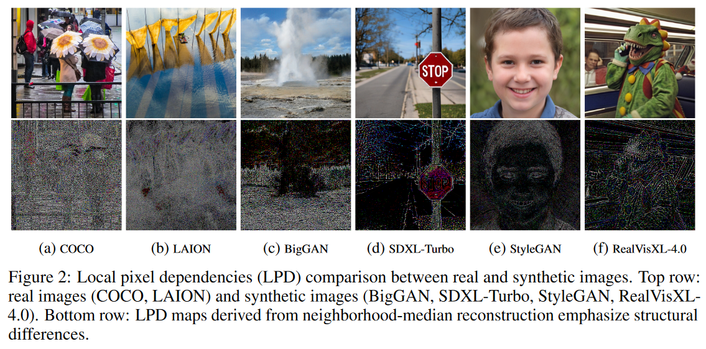
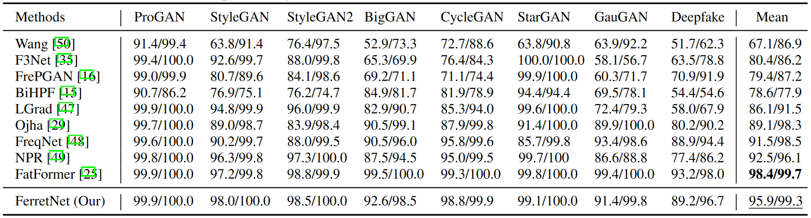
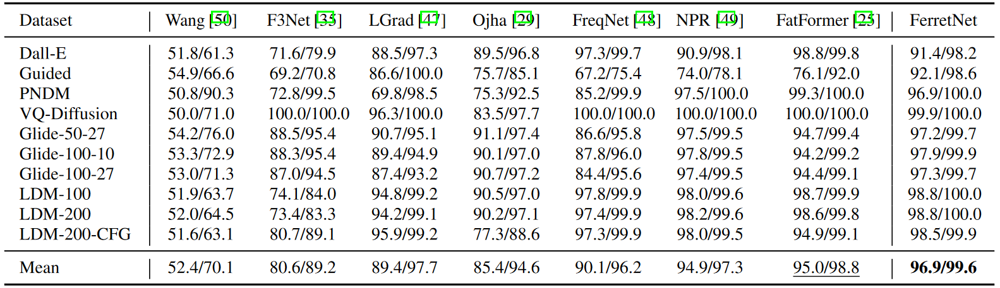
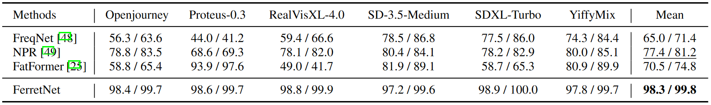

<div align="center">
<h2>🔎FerretNet: Efficient Synthetic Image Detection via Local Pixel Dependencies</h2>


[Shuqiao Liang](https://github.com/xigua7105), 
[Jian Liu](https://github.com/LiuJ421), 
RenZhang Chen, 
[Quanlong Guan](https://chanllon.github.io/) 

[//]: # (<sup>1</sup> School of Intelligent Systems Science and Engineering, Jinan University  )

[//]: # (<sup>2</sup> Modern Educational Technology Center, Jinan University  )

[//]: # (<sup>3</sup> College of Information Science and Technology, Jinan University  )

[//]: # (<sup>4</sup> Guandong Institute of Smart Education, Jinan University)


[](LICENSE)
[](https://arxiv.org/abs/2509.20890)

</div>
<div align="center">

</div>


## 📢 News
- **[2025.09.25]** **We have released the code, dataset and pre-trained model of [FerretNet](https://arxiv.org/abs/2509.20890)!**
- **[2025.09.18]** **FerretNet has been accepted by NeurIPS 2025!** 🎉🎉🎉


## 📝 Introduction
- We released two new test dataset: **Synthetic-Pop** and **Synthetic-Aesthetic**, more detail see 👉[detailed tutorial](docs/tutorial.md).
- We discussed the artifacts in synthetic images caused by latent variable sampling and decoding (showing as texture discontinuities, excessive smoothing, and other local anomalies). Based on this and the local pixel correlations of the Markov Random Field, we proposed a method to reconstruct synthetic images using local pixels, enabling the revelation of abnormal artifacts. Building upon the proposed synthetic image artifact extraction method, we introduce FerretNet, a lightweight neural network with only 1.1M parameters, which is trained from scratch using ProGAN-4cls. It achieves an average detection accuracy of 97.1% across synthetic images from 20+ generative models.


## 🚀 Usage 

### 1. Installation
- **Clone the repo**:
    ```
    git clone https://github.com/xigua7105/FerretNet.git
    cd FerretNet
    ```

- **Environment setup**:

  
  
  

  FerretNet works with Python 3.10+ and PyTorch 2.0+.
    ```
    conda create -n ferretnet python=3.10
    conda activate ferretnet
    pip install -r requirements.txt
    ```

### 2. QuickStart
- Download pre-trained model [ferretnet-b-median-3.pth](https://pan.baidu.com/s/1b6bz5j6pwCX_8_lhc7eIUA?pwd=A123).
- To quickly detect whether an image is AI-synthesized, run:
    ```
    python demo_image.py --cfg_path configs/Test.yaml
    ``` 
- To quickly detect whether a video is AI-synthesized, run:
    ```
    python demo_video.py --cfg_path configs/Test.yaml
    ``` 

### 3. Image Analysis
- We provide visualization tools for analyzing image in the "[analysis](analysis)" folder.
  ``` 
  python -m analysis.generate_images --image_dir path_to_your_image_dir --gen_mode v1
  ```


### 4. Model Zoo
- ⬇️ All checkpoints and configs can download from our [Baidu Disk link](https://pan.baidu.com/s/1b6bz5j6pwCX_8_lhc7eIUA?pwd=A123).


## 📝 Results

- 
  <details>
  <summary>Results on ForenSynths.</summary>
  <div align="center">
  
  </div>
  </details>

-
  <details>
  <summary>Results on Diffusion-6-class.</summary>
  <div align="center">
  
  </div>
  </details>

-
  <details>
  <summary>Results on Synthetic-Pop.</summary>
  <div align="center">
  
  </div>
  </details>

-
  <details>
  <summary>Results on VAR.</summary>
  Evaluate ACC and AP on images generated by the autoregressive model <a href="https://github.com/FoundationVision/VAR" target="_blank">VAR</a>. The data can be downloaded from our <a href="https://pan.baidu.com/s/1TeDdStERsYGCmBPaSDmmzw?pwd=A123" target="_blank">Baidu Disk link</a>.
  <table>
  <thead>
    <tr>
      <th>Method</th><th>VAR</th>
    </tr>
  </thead>
  <tbody>
    <tr>
      <td><a href="https://github.com/chuangchuangtan/NPR-DeepfakeDetection" target="_blank">NPR</a></td><td>82.9 / 83.7</td>
    </tr>
    <tr>
      <td><a href="https://github.com/chuangchuangtan/FreqNet-DeepfakeDetection" target="_blank">FreqNet</a></td><td>95.3 / 98.7</td>
    </tr>
    <tr>
      <td><a href="https://github.com/Michel-liu/FatFormer" target="_blank">FatFormer</a></td><td>83.9 / 91.1</td>
    </tr>
    <tr>
      <td><strong>FerretNet (Ours)</strong></td><td><strong>97.8 / 99.9</strong></td>
    </tr>
  </tbody>
  </table>
  </details>

-
  <details>
  <summary>More sota methods comparison. Updating...</summary>
  The reported results correspond to the average ACC and AP across four datasets: ForenSynths, Diffusion-6-cls, Synthetic-Pop, and Synthetic-Aesthetic.
  <table>
    <tr>
      <th>Methods</th><th>Ref</th><th>Image size</th><th>Params</th><th>FLOPs</th><th>FPS</th><th>ACC / AP</th>
    </tr>
    <tr>
      <td><a href="https://github.com/Megum1/CO-SPY" target="_blank">CO-SPY</a></td><td>CVPR 2025</td><td>384²</td><td>963.05M</td><td>644.80G</td><td>26.3</td><td>76.5 / 83.8</td>
    </tr>
    <tr>
      <td><a href="https://github.com/Michel-liu/FatFormer" target="_blank">FatFormer</a></td><td>CVPR 2024</td><td>224²</td><td>492.59M</td><td>269.92G</td><td>88.6</td><td>86.1 / 91.0</td>
    </tr>
    <tr>
      <td><a href="https://github.com/chuangchuangtan/FreqNet-DeepfakeDetection" target="_blank">FreqNet</a></td><td>AAAI 2024</td><td>256²</td><td>1.85M</td><td>2.58G</td><td>200.2</td><td>79.2 / 86.8</td>
    </tr>
    <tr>
      <td><a href="https://github.com/chuangchuangtan/NPR-DeepfakeDetection" target="_blank">NPR</a></td><td>CVPR 2024</td><td>256²</td><td>1.44M</td><td>2.29G</td><td>720.9</td><td>86.5 / 89.4</td>
    </tr>
    <tr>
      <td><a href="https://github.com/Ouxiang-Li/SAFE" target="_blank">SAFE</a></td><td>KDD 2025</td><td>256²</td><td>1.44M</td><td>2.29G</td><td>770.2</td><td>96.8 / 99.3</td>
    </tr>
    <tr>
      <td><b>FerretNet (Ours)</b></td><td>NeurIPS 2025</td><td>256²</td><td><b>1.06M</b></td><td><b>2.38G</b></td><td><b>772.1</b></td><td><b>97.1 / 99.6</b></td>
    </tr>
  </table>
  </details>

- More details can be found in 👉[detailed results](docs/results).


## 🥰 Train
- **We provide a 👉[detailed tutorial](docs/tutorial.md) for training your own models.**


## 👍 Acknowledgements
- Thanks to these open-source repositories ([CNNDetection](https://github.com/PeterWang512/CNNDetection), [DIRE](https://github.com/ZhendongWang6/DIRE), [UniversalFakeDetect](https://github.com/Yuheng-Li/UniversalFakeDetect) and [FatFormer](https://github.com/Michel-liu/FatFormer)) for their contribution to advancing the development of synthetic image detection.

## 🌟 Citation
- If the code, dataset and paper help your research, please cite our paper:

  ```BibTeX

  ```

## License
This project is released under the Apache 2.0 license. Please see the [LICENSE](LICENSE) file for more information.
